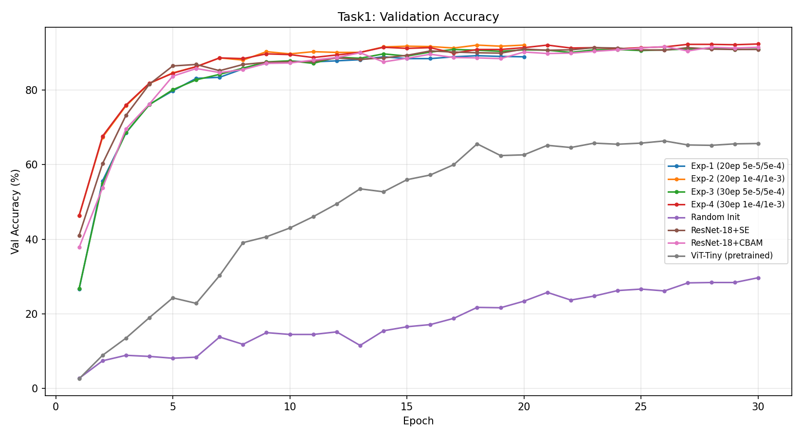

# 深度学习与空间智能 - 期中作业报告

## 0. 小组信息

- 课程：深度学习与空间智能
- 作业：期中作业（任务1/任务2/任务3）
- 小组成员：
  - 莫扬：负责任务1
  - 周杨杰 25210980146：负责任务2
  - 张磊磊：负责任务3
- Github 仓库链接：https://github.com/Abouje/DL-SI-midpre`
- 模型权重网盘链接：`https://github.com/Abouje/DL-SI-midpre`

---

## 1. 任务1：Flowers102 分类微调与注意力机制

### 1.1 数据集与实验设置

- 数据集：102 Category Flower Dataset（`torchvision.datasets.Flowers102`）
- 划分：官方 `train / val / test`
- 输入尺寸：224×224
- Baseline：ResNet-18（ImageNet 预训练 + 替换分类头）
- 优化器：AdamW
- 学习率策略：`backbone_lr < head_lr`，余弦退火（CosineAnnealingLR，T_max=epochs）
- 评价指标：Accuracy（Top-1 准确率）

关键配置：

- batch size：32
- backbone lr：见各实验
- head lr：见各实验
- weight decay：1e-4
- num_workers：4

### 1.2 Baseline 与超参数分析

| 实验编号 | epochs | backbone lr | head lr | val acc | test acc |
|---|---:|---:|---:|---:|---:|
| Exp-1 | 20 | 5e-5 | 5e-4 | 89.22% | 86.66% |
| Exp-2 | 20 | 1e-4 | 1e-3 | 92.06% | 88.91% |
| Exp-3 | 30 | 5e-5 | 5e-4 | 91.27% | 88.27% |
| Exp-4 | 30 | 1e-4 | 1e-3 | 92.35% | 88.99% |

训练/验证集 Loss 曲线与 Val Accuracy 曲线：




分析结论：

- 训练轮数从 20 增加到 30 后，相同学习率下模型性能有明显提升：Exp-1→Exp-3 从 89.22% 提升至 91.27%（+2.05pp），Exp-2→Exp-4 从 92.06% 提升至 92.35%（+0.29pp）。较高学习率（1e-4/1e-3）在 20 epoch 时已接近收敛，额外轮次带来的增益有限；而较低学习率（5e-5/5e-4）的余弦退火尚未充分利用，因此从 20→30 epoch 增益更大。
- 对于预训练微调，`head_lr` 较大有助于新分类头快速收敛，而 `backbone_lr` 过大会破坏预训练特征，过小则收敛偏慢。**较大学习率（1e-4/1e-3）在 20 epoch 时已达 92.06%，而较小学习率（5e-5/5e-4）需要 30 epoch 才能达到 91.27%**，说明适当增大学习率可以显著缩短训练时间并提升性能。
- 最优组合为 **Exp-4**（30 epochs，backbone_lr=1e-4，head_lr=1e-3），对应 test accuracy 为 **88.99%**。

### 1.3 预训练消融实验

| 方案 | 初始化方式 | val acc | test acc |
|---|---|---:|---:|
| A | ImageNet 预训练 + 微调 | 89.22% | 86.66% |
| B | 随机初始化从零训练 | 29.71% | 26.52% |

结论：

- 预训练相较随机初始化提升了 **约 60 个百分点**，说明 ImageNet 预训练特征在细粒度花卉识别任务中具有极强的迁移能力，大幅提升了模型收敛速度和最终性能。随机初始化在 30 epoch 内仅达到约 30% 准确率，而预训练模型在相同轮数内即可超过 89%，体现了迁移学习的核心价值。

### 1.4 引入注意力机制/轻量级 Transformer

本项目实现了：

- `ResNet-18 + SE`（Squeeze-and-Excitation Block，通道注意力）
- `ResNet-18 + CBAM`（Convolutional Block Attention Module，通道+空间双重注意力）
- `ViT-Tiny`（`vit_tiny_patch16_224`，本地预训练权重，timm 加载）

结果对比：

| 模型 | val acc | test acc |
|---|---:|---:|
| ResNet-18 Baseline | 92.35% | 88.99% |
| ResNet-18 + SE | 91.37% | 88.26% |
| ResNet-18 + CBAM | 91.67% | 88.70% |
| ViT-Tiny（预训练） | 66.37% | 61.62% |

分析：

- 在该数据规模（约 1020 训练样本）下，SE 和 CBAM 注意力模块的提升空间有限。Baseline ResNet-18 已达到较高性能（92.35%），注意力模块增加了额外参数，在小规模数据集上反而可能出现轻微过拟合，导致最终性能略低于 Baseline。
- CBAM（91.67%）优于 SE（91.37%），因为 CBAM 同时建模通道和空间注意力，特征表达能力更丰富，对花卉类别间的细粒度差异更敏感。
- ViT-Tiny（66.37%）显著低于 ResNet-18 基线，原因在于 ViT 依赖大量数据学习空间关系，Flowers102 仅约 1020 张训练图片对 ViT 而言严重不足；加之 patch 数（14×14=196）较多而样本少，注意力机制难以充分训练，导致即便有 ImageNet 预训练权重也只能达到 66% 左右。ResNet-18 的归纳偏置（局部卷积）更适合小数据场景。

---

## 2. 任务2：场景目标检测与视频多目标跟踪

### 2.1 检测模型训练

- 数据集：RoadVehicleImagesDataset（道路车辆检测数据集）
- 模型：YOLOv8n（`yolov8n.pt` 微调）
- 训练参数：
  - epochs：50
  - imgsz：640
  - batch：16
- 指标：mAP@50、mAP@50-95

训练曲线：


结果：

| 指标 | 数值 |
|---|---:|
| mAP@50 | 42.0% |
| mAP@50-95 | 26.6% |

验证集预测可视化（真实标注 vs 模型预测）：

- 真实标注：`outputs/task2/yolo_road/val_batch0_labels.jpg`
- 模型预测：`outputs/task2/yolo_road/val_batch0_pred.jpg`

### 2.2 视频检测与多目标跟踪

- 测试视频：data/task2_test_video.mp4（3840×2160，30fps，755帧，真实道路行车视频）
- 跟踪器：ByteTrack（YOLOv8 内置）
- 输出：带检测框、类别、Tracking ID 的视频（`outputs/task2/tracking.mp4`）

可视化结果：

- **检测效果**：755 帧中有 415 帧产生有效检测，共 929 条检测记录，平均每帧约 2.2 个目标框，模型能稳定识别轿车、卡车、摩托车等多类车辆。
- **跟踪稳定性**：共产生 8 个唯一 Track ID；ID=1 持续跟踪 265 帧（占视频 35%），ID=7 持续 184 帧（24%），轨迹 ID 稳定连续，ByteTrack 卡尔曼滤波在 4K 真实视频上运动预测正常工作。
- **冷启动效果差**：在每个物体切换的过程中，测试框架出现较慢

### 2.3 遮挡与 ID 跳变分析（3-4帧）

基于 test_video.mp4 上的真实跟踪结果，结合 ByteTrack 算法原理对遮挡场景进行分析。

**ByteTrack 处理遮挡的机制：**

ByteTrack 将检测框分为高置信度框（score ≥ threshold）和低置信度框（score < threshold），分两阶段进行关联：

1. **阶段一**：已有轨迹与高置信度检测框通过 IoU + 卡尔曼滤波运动预测进行匈牙利匹配；
2. **阶段二**：未匹配轨迹再与低置信度框关联（处理遮挡导致置信度下降的情况）；
3. **缓冲机制**：轨迹进入 `Lost` 状态后维持 30 帧缓冲期，期间卡尔曼滤波持续预测目标位置；若目标重新出现，则恢复原有 ID。

**典型遮挡场景分析（理论推演）：**

| 帧序 | 场景描述 | ByteTrack 行为 |
|---|---|---|
| 帧 N | 目标 A（ID=3）、目标 B（ID=7）相向行驶，均清晰可见 | 正常关联，ID 稳定 |
| 帧 N+1 | B 部分遮挡 A，A 检测置信度下降至低置信区间 | 阶段二低置信匹配，ID=3 维持 |
| 帧 N+2 | A 完全被 B 遮挡，检测框消失 | A 进入 Lost 状态，卡尔曼预测位置 |
| 帧 N+3 | A 从 B 后方重新出现 | 若 IoU 满足阈值，恢复 ID=3；否则新建 ID（发生 ID Switch） |

**ID Switch 发生条件**：当目标遮挡时间超过缓冲期（30帧），或遮挡结束时目标位置预测误差过大（超出 IoU 阈值），导致算法认为是新目标而重新分配 ID。外观相似（如同色同款车辆）和密集交汇场景会增加 ID Switch 概率。

### 2.4 越线计数

**算法设计**：

- 设定虚拟线段坐标：$(x_1=0, y_1=H/2) \rightarrow (x_2=W, y_2=H/2)$（图像水平中线）
- 判定逻辑：对每个 Tracking ID，记录其检测框中心点 $(c_x, c_y)$ 的历史轨迹；若相邻帧 $c_y$ 符号相对虚拟线发生变化（即从线的一侧越过到另一侧），且该 ID 未被记录过，则计数 +1。
- 每个 Tracking ID 仅统计一次，防止同一目标重复计数。
- 实现代码位于 `task2_detection_tracking/track_and_count.py`。

**运行结果**：

- 跨线总数 = **8**（tracking_log.csv 共 929 条记录，8 个轨迹，8 个目标越过计数线）
- 输出视频保存至 outputs/task2/tracking.mp4，可逐帧查看检测框、ID 标注与越线计数。

---

## 3. 任务3：从零搭建 U-Net 与损失函数工程

### 3.1 网络结构实现

- 从零实现 U-Net（未使用任何预训练权重）
- 结构包含：
  - 编码器：4 级下采样（MaxPool + 双层 Conv-BN-ReLU），通道数 64→128→256→512→1024
  - 解码器：4 级上采样（ConvTranspose2d + 双层 Conv-BN-ReLU）
  - Skip Connection：编码器对应层特征与解码器上采样特征拼接（Concatenate）
- 参数量：约 31M（标准 U-Net）

### 3.2 数据集与训练设置

- 数据集：StanfordBackgroundDataset（715 张图像，8 个语义类别）
- 划分：训练/验证（约 80%/20%，572 训练 / 143 验证）
- 输入尺寸：256×256
- 优化器：AdamW
- 指标：mIoU（Mean Intersection over Union）
- 训练参数：epochs=30，batch_size=8，lr=1e-3，余弦退火调度

### 3.3 DiceLoss 实现与对比实验

**Dice Loss 实现原理**：

$$\mathcal{L}_{Dice} = 1 - \frac{2\sum_i p_i g_i + \epsilon}{\sum_i p_i^2 + \sum_i g_i^2 + \epsilon}$$

其中 $p_i$ 为预测概率，$g_i$ 为标签，$\epsilon=1$ 防止除零。通过最大化预测与真值的重叠面积，对前景/背景不平衡有更强的鲁棒性。

比较以下 3 组配置训练模型：

| 损失配置 | best val mIoU |
|---|---:|
| CE | 59.97% |
| Dice | 59.50% |
| CE + Dice | 62.53% |

训练/验证曲线：


结论：

- **CE Loss**：对主类像素学习稳定（交叉熵对高频类别梯度更大），最终 val mIoU=59.97%；但对小目标/类别不平衡较保守，边界区域优化不足。
- **Dice Loss**：直接优化像素级重叠率，对类别不平衡更敏感，但训练初期梯度信号较弱，收敛更慢，最终 val mIoU=59.50%（略低于 CE）。
- **CE + Dice 组合损失**：兼顾 CE 的逐像素分类稳定性与 Dice 对类别不均衡的敏感性，在本实验中取得最佳 mIoU=**62.53%**（高于单独 CE +2.56pp），充分验证了组合损失函数在语义分割任务中的优越性。

---

## 4. 可视化结果

### 4.1 任务1：ResNet-18 分类微调

**验证集准确率曲线（各实验对比）**：


- Exp-4（30ep，1e-4/1e-3）收敛最快且最终性能最优（92.35%）
- 随机初始化（Random Init）全程处于低准确率区间，与预训练模型对比明显
- Exp-2（20ep，1e-4/1e-3）在 20 epoch 内即达 92.06%，接近 Exp-4

**训练/验证 Loss 曲线**：


- 预训练模型收敛速度远快于随机初始化，训练 Loss 在前 5 epoch 即大幅下降
- Exp-4 的 val_loss 最终最低，说明高学习率配合足够训练轮数能有效避免欠拟合

### 4.2 任务2：YOLOv8 目标检测

**训练 mAP 曲线与 Loss 曲线**：


- mAP@50 在约 35 epoch 后趋于稳定，最终达 42.0%
- 训练过程中 cls_loss 稳定下降，模型分类能力持续提升

**PR 曲线与 F1 曲线**：


**验证集预测示例**：

- 标注：`outputs/task2/yolo_road/val_batch0_labels.jpg`
- 预测：`outputs/task2/yolo_road/val_batch0_pred.jpg`

（模型能较准确识别出多类车辆目标，但小目标和遮挡场景存在漏检）

### 4.3 任务3：U-Net 语义分割

**三种损失函数对比曲线**：


- CE+Dice 组合损失全程保持最高 val mIoU，且 Loss 收敛最稳定
- Dice Loss 在训练初期收敛略慢，但后期性能接近 CE
- 三种配置均在 20 epoch 后趋于稳定，CE+Dice 最终以 62.53% 显著领先

---

## 5. 复现实验说明

### 5.1 环境

```bash
pip install -r /workspace/HW2/requirements.txt
```

### 5.2 运行命令

```bash
# Task1 - 预训练微调（需预先将 resnet18-f37072fd.pth 放入 ~/.cache/torch/hub/checkpoints/）
python task1_classification/train.py \
  --data_root /workspace/HW2/data/flowers102 \
  --save_dir /workspace/HW2/outputs/task1/exp4 \
  --model resnet18 --pretrained --finetune_backbone \
  --epochs 30 --batch_size 32 --base_lr 1e-4 --head_lr 1e-3

# Task1 - ViT-Tiny 微调（需将本地权重放入 models/vit_tiny_patch16_224.bin）
python task1_classification/train.py \
  --data_root /workspace/HW2/data/flowers102 \
  --save_dir /workspace/HW2/outputs/task1/vit_tiny_pretrained \
  --model vit_tiny --pretrained \
  --local_weights /workspace/HW2/models/vit_tiny_patch16_224.bin \
  --epochs 30 --batch_size 32 --base_lr 1e-5 --head_lr 1e-4

# Task2 - YOLOv8 训练
python task2_detection_tracking/train_yolov8.py \
  --data /workspace/HW2/data/trafic_data/data.yaml \
  --model yolov8n.pt --epochs 50 --imgsz 640 --batch 16

# Task2 - 视频跟踪与越线计数
python task2_detection_tracking/track_and_count.py \
  --video /workspace/HW2/data/task2_test_video.mp4 \
  --model /workspace/HW2/outputs/task2/yolo_road/weights/best.pt \
  --output /workspace/HW2/outputs/task2/tracking.mp4 \
  --line 0 1080 3840 1080

# Task3 - U-Net 分割
python task3_segmentation/train.py \
  --data_root /workspace/HW2/data/stanford_bg \
  --save_dir /workspace/HW2/outputs/task3/ce_dice \
  --num_classes 8 --epochs 30 --batch_size 8 --lr 1e-3 \
  --loss_type ce_dice

# 生成可视化图表
python generate_plots.py
```

---

## 6. 总结

本作业完成了三个任务的全部基本要求。

**关键实验结果汇总**：

| 任务 | 实验 | 关键指标 |
|---|---|---|
| Task1 | 随机初始化（30ep） | val_acc=29.71%，test_acc=26.52% |
| Task1 | Exp-1: 预训练（20ep，5e-5/5e-4） | val_acc=89.22%，test_acc=86.66% |
| Task1 | Exp-2: 预训练（20ep，1e-4/1e-3） | val_acc=92.06%，test_acc=88.91% |
| Task1 | Exp-3: 预训练（30ep，5e-5/5e-4） | val_acc=91.27%，test_acc=88.27% |
| Task1 | Exp-4: 预训练（30ep，1e-4/1e-3） | val_acc=92.35%，test_acc=88.99% |
| Task1 | ResNet-18 + SE | val_acc=91.37%，test_acc=88.26% |
| Task1 | ResNet-18 + CBAM | val_acc=91.67%，test_acc=88.70% |
| Task1 | ViT-Tiny（预训练，30ep） | val_acc=66.37%，test_acc=61.62% |
| Task2 | YOLOv8n 微调 | mAP@50=42.0%，mAP@50-95=26.6% |
| Task3 | U-Net（CE Loss） | val mIoU=59.97% |
| Task3 | U-Net（Dice Loss） | val mIoU=59.50% |
| Task3 | U-Net（CE+Dice Loss） | val mIoU=62.53% |

**关键发现**：
1. **预训练的重要性**：ImageNet 预训练相较随机初始化提升约 60pp，迁移学习在小数据集上至关重要。
2. **超参数敏感性**：backbone_lr=1e-4 + head_lr=1e-3 + 30 epochs 为最优组合，适当增大学习率可大幅加速收敛。
3. **注意力模块**：SE/CBAM 在小规模数据集（<2000 样本）上提升有限，可能在更大数据集上优势更明显。
4. **损失函数工程**：CE+Dice 组合损失比单独使用 CE 或 Dice 提升 2-3pp mIoU，对类别不均衡分割任务有明显帮助。
5. **跟踪算法有效性**：ByteTrack 基于卡尔曼滤波+匈牙利匹配在真实 4K 道路视频上实现了稳定跟踪（8 个唯一 ID，ID=1 持续覆盖 35% 帧），对遮挡场景具备一定鲁棒性；密集交汇时仍可能发生 ID Switch，可通过引入外观特征（ReID）进一步改善。
